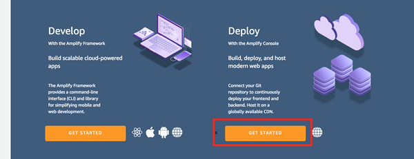
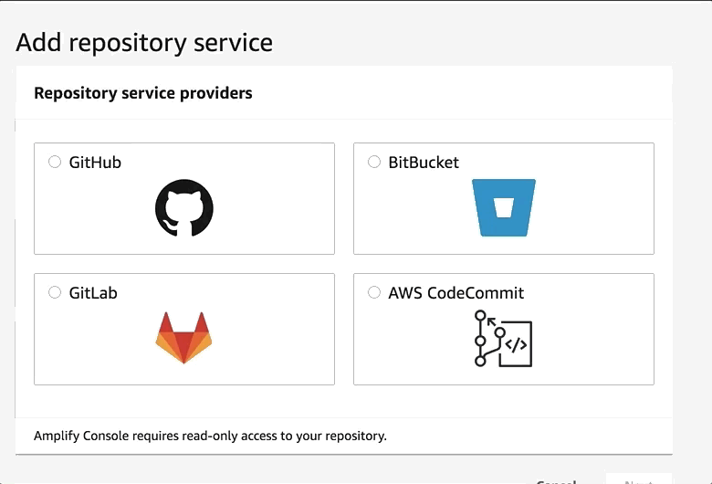

Nesse guia você vai aprender como publicar e hospedar o seu site Gastby usando o [console AWS Amplify](https://console.amplify.aws).

AWS Amplify é uma combinação de bibliotecas de cliente, ferramentas de CLI e um console para publicação contínua e hospedagem. O CLI do Amplify e a sua biblioteca permite que os desenvolvedores entrem em funcionamento com aplicativos em nuvem completos e recursos como autenticação, armazenamento, APIs GraphQL ou REST sem servidor, análises, funções Lambda e mais. O console Amplify provê hospedagem e publicação contínua para aplicativos web modernos (aplicativos de página única e geradores de sites estáticos). Publicação contínua permite aos desenvolvedores publicarem atualizações no seus aplicativos web a cada _commit_ de código em seu reposítorio Git. A hospedagem inclui recursos como CDNs disponíveis globalmente, fácil configuração de domínio customizado + HTTPS, implantação de _branch_ de recursos e proteção por senha.

## Pré requisitos

1. [Increva-se para um conta AWS](https://portal.aws.amazon.com/billing/signup?redirect_url=https%3A%2F%2Faws.amazon.com%2Fregistration-confirmation). Não há cobranças antecipadas ou quaisquer compromissos de prazo parar criar uma conta de AWS e a inscrição fornece acesso imediato ao nível gratuito da AWS.

1. Esse guia assume que você configurou um projeto com Gatsby. Se você precisa configurar um projeto, comece com o [Gatsby Auth starter com AWS Amplify](https://github.com/dabit3/gatsby-auth-starter-aws-amplify) e então volte aqui. O _starter_ implementa um fluxo de autenticação básico para inscrição e _login_ de usuários, bem como roteamento protegido do lado do cliente.

## Publicação

1. Faça _login_ no [console AWS Amplify](https://console.aws.amazon.com/amplify/home) e escolha a opção Iniciar abaixo de publicar.
   

1. Conecte uma _branch_ do seu repositório no Github, Bitbucket, GitLab ou AWS CodeCommit. Conectando o seu repositório permite o Amplify publicar atualizações a cada _commit_ de código na _branch_.
   

1. Aceite as configurações de construção padrão. Dê permissões ao console do Amplify para publicar recursos no _backend_ com seu _frontend_ com uma função de serviço. Isso permite que o console detecte mudanças em ambos _backend_ e _frontend_ a cada _commit_ de código e realize atualizações. Se você não tem funções de serviço siga as solicitações para criar uma e então volte ao console e selecione uma no menu suspenso.
   

1. Revise suas modificações e então escolha **Salvar e publicar**. O console do Amplify vai baixar o código do seu repositório, construir as mudanças no _backend_ e no _frontend_ e publicar seus artefatos construídos no `https://master.unique-id.amplifyapp.com`. Bônus: Capturas de tela do seu aplicativo em diferentes dispositivos para encontrar problemas no layout :fire:
   

## Referências:

- [Publicando seu próximo site Gatsby no AWS com AWS Amplify](/blog/2018-08-24-gatsby-aws-hosting/)
- Se você quer mais controle sobre a hospedagem no AWS você também pode [publicar seu site Gatsby.js para o AWS S3](/docs/deploying-to-s3-cloudfront/)

### Mais recursos

Transmissão ao vivo de Jason Lengstorf e Nader Dabit construindo um site e publicando com AWS Amplify

https://youtu.be/i9HG8CV-_dQ
